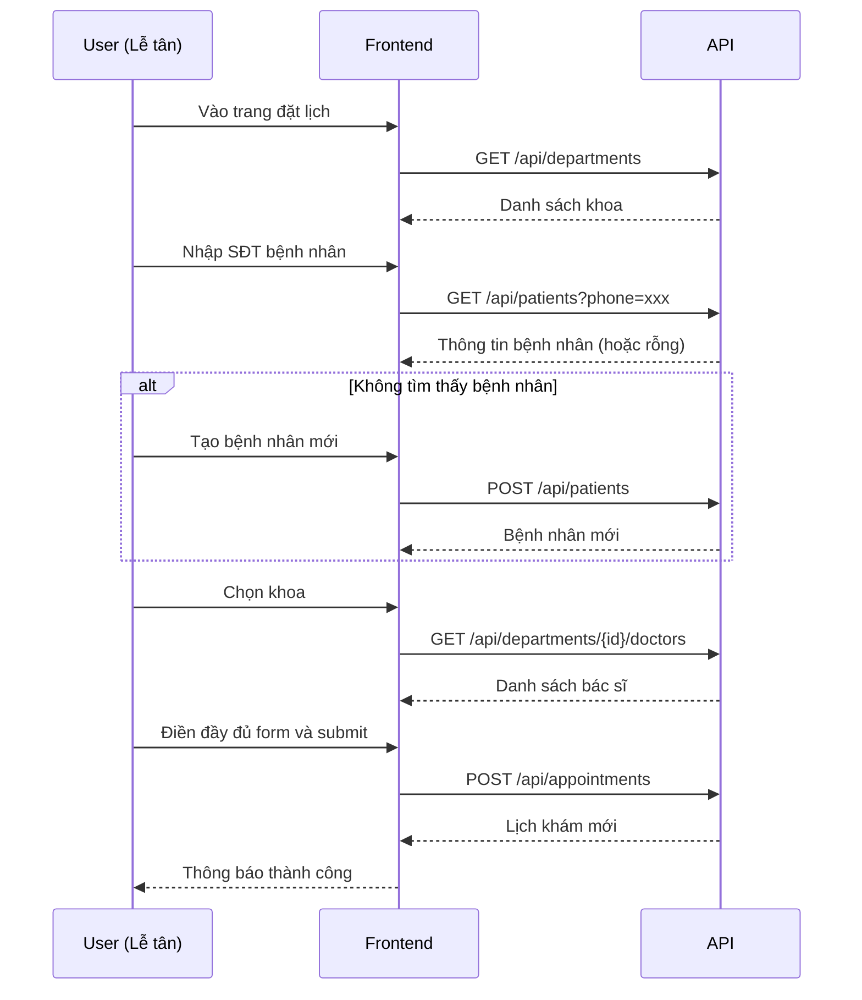
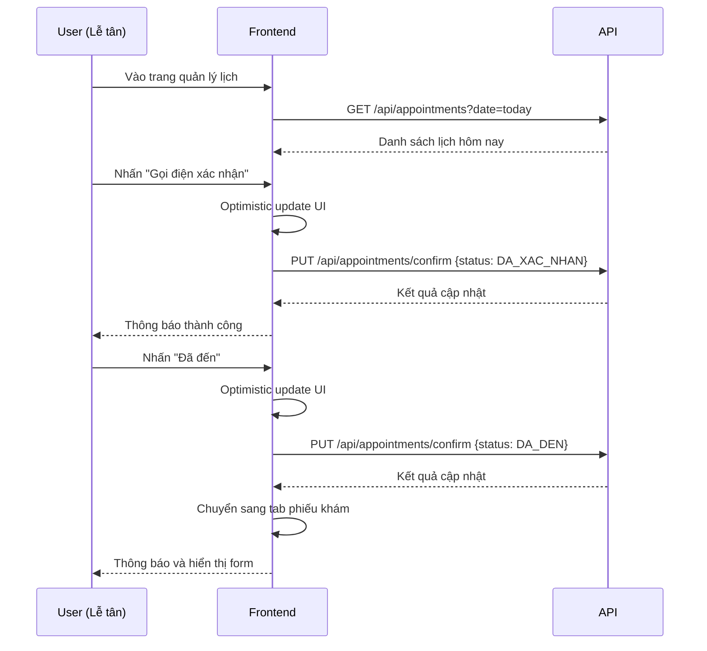
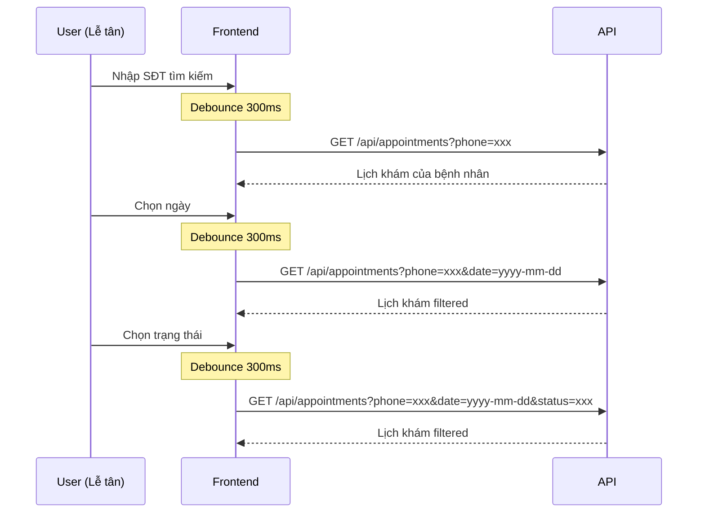

**Request Example:**
```http
GET /api/appointments?phone=0123456789&date=2025-10-12&status=CHO_XAC_NHAN
```

**Response Success (200):**
```json
{
  "data": [
    {
      "id": 101,
      "fullName": "Nguyễn Văn A",
      "phone": "0123456789",
      "gender": "NAM",
      "birth": "1990-05-15",
      "email": "nguyenvana@email.com",
      "address": "123 Đường ABC, Quận 1, TP.HCM",
      "date": "2025-10-12",
      "time": "09:00",
      "symptoms": "Đau đầu, chóng mặt",
      "status": "CHO_XAC_NHAN",
      "healthPlanResponse": {
        "id": 5,
        "name": "Khám tổng quát",
        "price": 500000
      },
      "doctorResponse": {
        "id": 20,
        "position": "Bác sĩ Trần Thị B",
        "available": true
      },
      "departmentResponse": {
        "id": 3,
        "name": "Khoa Nội Tổng Hợp"
      },
      "notes": "Bệnh nhân cần khám gấp",
      "createdAt": "2025-10-10T08:30:00",
      "updatedAt": "2025-10-10T08:30:00"
    },
    {
      "id": 102,
      "fullName": "Lê Thị C",
      "phone": "0987654321",
      "gender": "NU",
      "birth": "1985-12-20",
      "email": null,
      "address": "456 Đường XYZ, Quận 2, TP.HCM",
      "date": "2025-10-12",
      "time": "10:30",
      "symptoms": "Ho, sốt nhẹ",
      "status": "DA_XAC_NHAN",
      "healthPlanResponse": null,
      "doctorResponse": {
        "id": 21,
        "position": "Bác sĩ Phạm Văn D",
        "available": true
      },
      "departmentResponse": {
        "id": 1,
        "name": "Khoa Hô Hấp"
      },
      "notes": null,
      "createdAt": "2025-10-09T14:20:00",
      "updatedAt": "2025-10-11T16:45:00"
    }
  ],
  "message": "Lấy danh sách lịch khám thành công"
}
```

**Response Error (400):**
```json
{
  "data": null,
  "message": "Tham số không hợp lệ"
}
```

**Response Error (401):**
```json
{
  "data": null,
  "message": "Unauthorized - Token không hợp lệ hoặc đã hết hạn"
}
```

**Sử dụng khi:**
- Component mount → Tự động load lịch ngày hôm nay
- Nhập số điện thoại trong form tìm kiếm
- Chọn ngày khám
- Chọn trạng thái filter
- Sau khi cập nhật trạng thái (để refresh)

---

### 1.2. Tạo lịch khám mới

**Endpoint:** `POST /api/appointments`

**Mô tả:** Tạo lịch hẹn khám mới cho bệnh nhân

**Headers:**
```json
{
  "Authorization": "Bearer {JWT_TOKEN}",
  "Content-Type": "application/json"
}
```

**Request Body:**
```json
{
  "patientId": 150,
  "doctorId": 20,
  "departmentId": 3,
  "appointmentDate": "2025-10-15",
  "appointmentTime": "14:00",
  "symptoms": "Đau bụng, buồn nôn",
  "notes": "Bệnh nhân đã từng phẫu thuật ruột thừa"
}
```

**Body Parameters:**
| Tham số | Kiểu | Bắt buộc | Mô tả |
|---------|------|----------|-------|
| `patientId` | number | **Có** | ID bệnh nhân |
| `doctorId` | number | **Có** | ID bác sĩ khám |
| `departmentId` | number | **Có** | ID khoa khám |
| `appointmentDate` | string | **Có** | Ngày khám (YYYY-MM-DD) |
| `appointmentTime` | string | **Có** | Giờ khám (HH:mm) |
| `symptoms` | string | Không | Triệu chứng của bệnh nhân |
| `notes` | string | Không | Ghi chú thêm |

**Response Success (201):**
```json
{
  "data": {
    "id": 103,
    "fullName": "Nguyễn Văn E",
    "phone": "0912345678",
    "gender": "NAM",
    "birth": "1995-03-10",
    "email": "nguyenvane@email.com",
    "address": "789 Đường DEF, Quận 3, TP.HCM",
    "date": "2025-10-15",
    "time": "14:00",
    "symptoms": "Đau bụng, buồn nôn",
    "status": "CHO_XAC_NHAN",
    "healthPlanResponse": null,
    "doctorResponse": {
      "id": 20,
      "position": "Bác sĩ Trần Thị B",
      "available": true
    },
    "departmentResponse": {
      "id": 3,
      "name": "Khoa Nội Tổng Hợp"
    },
    "notes": "Bệnh nhân đã từng phẫu thuật ruột thừa",
    "createdAt": "2025-10-12T10:30:00",
    "updatedAt": "2025-10-12T10:30:00"
  },
  "message": "Tạo lịch khám thành công"
}
```

**Response Error (400):**
```json
{
  "data": null,
  "message": "Thiếu thông tin bắt buộc: patientId, doctorId, departmentId"
}
```

**Response Error (404):**
```json
{
  "data": null,
  "message": "Không tìm thấy bệnh nhân với ID: 150"
}
```

**Response Error (409):**
```json
{
  "data": null,
  "message": "Bác sĩ đã có lịch khám vào thời gian này"
}
```

**Sử dụng khi:**
- Submit form đặt lịch mới
- Sau khi đã chọn đầy đủ: bệnh nhân, bác sĩ, khoa, ngày giờ

---

### 1.3. Xác nhận / Cập nhật trạng thái lịch khám

**Endpoint:** `PUT /api/appointments/confirm`

**Mô tả:** Cập nhật trạng thái lịch khám (xác nhận, đã đến, không đến)

**Headers:**
```json
{
  "Authorization": "Bearer {JWT_TOKEN}",
  "Content-Type": "application/json"
}
```

**Request Body:**
```json
{
  "id": 101,
  "status": "DA_XAC_NHAN"
}
```

**Body Parameters:**
| Tham số | Kiểu | Bắt buộc | Mô tả |
|---------|------|----------|-------|
| `id` | number | **Có** | ID lịch khám |
| `status` | string | **Có** | Trạng thái mới (CHO_XAC_NHAN, DA_XAC_NHAN, DA_DEN, KHONG_DEN) |

**Response Success (200):**
```json
{
  "data": {
    "id": 101,
    "fullName": "Nguyễn Văn A",
    "phone": "0123456789",
    "gender": "NAM",
    "birth": "1990-05-15",
    "email": "nguyenvana@email.com",
    "address": "123 Đường ABC, Quận 1, TP.HCM",
    "date": "2025-10-12",
    "time": "09:00",
    "symptoms": "Đau đầu, chóng mặt",
    "status": "DA_XAC_NHAN",
    "healthPlanResponse": {
      "id": 5,
      "name": "Khám tổng quát",
      "price": 500000
    },
    "doctorResponse": {
      "id": 20,
      "position": "Bác sĩ Trần Thị B",
      "available": true
    },
    "departmentResponse": {
      "id": 3,
      "name": "Khoa Nội Tổng Hợp"
    },
    "notes": "Bệnh nhân cần khám gấp",
    "createdAt": "2025-10-10T08:30:00",
    "updatedAt": "2025-10-12T11:15:00"
  },
  "message": "Cập nhật trạng thái thành công"
}
```

**Response Error (400):**
```json
{
  "data": null,
  "message": "Trạng thái không hợp lệ"
}
```

**Response Error (404):**
```json
{
  "data": null,
  "message": "Không tìm thấy lịch khám với ID: 101"
}
```

**Sử dụng khi:**
- Nhấn nút "Gọi điện xác nhận" → `status: "DA_XAC_NHAN"`
- Nhấn nút "Đã đến" → `status: "DA_DEN"`
- Nhấn nút "Không đến" → `status: "KHONG_DEN"`

---

## 2. PATIENT APIs

### 2.1. Tìm bệnh nhân theo số điện thoại

**Endpoint:** `GET /api/patients`

**Mô tả:** Tìm kiếm bệnh nhân theo số điện thoại

**Headers:**
```json
{
  "Authorization": "Bearer {JWT_TOKEN}",
  "Content-Type": "application/json"
}
```

**Query Parameters:**
| Tham số | Kiểu | Bắt buộc | Mô tả |
|---------|------|----------|-------|
| `phone` | string | **Có** | Số điện thoại bệnh nhân |

**Request Example:**
```http
GET /api/patients?phone=0123456789
```

**Response Success (200):**
```json
{
  "data": {
    "patients": [
      {
        "id": 150,
        "code": "BN150",
        "bloodType": "O",
        "weight": 65,
        "height": 170,
        "registrationDate": "2024-01-15",
        "phone": "0123456789",
        "fullName": "Nguyễn Văn A",
        "address": "123 Đường ABC, Quận 1, TP.HCM",
        "cccd": "001234567890",
        "birth": "1990-05-15",
        "gender": "NAM",
        "profileImage": "https://example.com/images/profile150.jpg",
        "relationship": "CHU TAI KHOAN",
        "email": "nguyenvana@email.com"
      },
      {
        "id": 151,
        "code": "BN151",
        "bloodType": "A",
        "weight": 50,
        "height": 160,
        "registrationDate": "2024-01-15",
        "phone": null,
        "fullName": "Nguyễn Thị F (Con)",
        "address": "123 Đường ABC, Quận 1, TP.HCM",
        "cccd": "001234567891",
        "birth": "2015-08-20",
        "gender": "NU",
        "profileImage": null,
        "relationship": "CON",
        "email": null
      }
    ],
    "ownerId": 150
  },
  "message": "Tìm kiếm bệnh nhân thành công"
}
```

**Response Success - Không tìm thấy (200):**
```json
{
  "data": {
    "patients": [],
    "ownerId": null
  },
  "message": "Không tìm thấy bệnh nhân"
}
```

**Response Error (400):**
```json
{
  "data": null,
  "message": "Số điện thoại không được để trống"
}
```

**Sử dụng khi:**
- Nhập số điện thoại trong form đặt lịch
- Nhấn nút "Tìm" bệnh nhân

---

### 2.2. Tạo bệnh nhân mới

**Endpoint:** `POST /api/patients`

**Mô tả:** Tạo hồ sơ bệnh nhân mới trong hệ thống

**Headers:**
```json
{
  "Authorization": "Bearer {JWT_TOKEN}",
  "Content-Type": "application/json"
}
```

**Request Body:**
```json
{
  "phone": "0912345678",
  "email": "nguyenvane@email.com",
  "fullName": "Nguyễn Văn E",
  "address": "789 Đường DEF, Quận 3, TP.HCM",
  "cccd": "001234567892",
  "birth": "1995-03-10",
  "gender": "NAM",
  "bloodType": "B",
  "weight": 70,
  "height": 175,
  "profileImage": null,
  "phoneLink": null
}
```

**Body Parameters:**
| Tham số | Kiểu | Bắt buộc | Mô tả |
|---------|------|----------|-------|
| `phone` | string/null | **Có** | Số điện thoại chính |
| `email` | string/null | Không | Email |
| `fullName` | string | **Có** | Họ và tên |
| `address` | string | **Có** | Địa chỉ |
| `cccd` | string | **Có** | Số CCCD/CMND |
| `birth` | string | **Có** | Ngày sinh (YYYY-MM-DD) |
| `gender` | string | **Có** | Giới tính (NAM/NU) |
| `bloodType` | string | **Có** | Nhóm máu (A/B/AB/O) |
| `weight` | number | **Có** | Cân nặng (kg) |
| `height` | number | **Có** | Chiều cao (cm) |
| `profileImage` | string/null | Không | URL ảnh đại diện |
| `phoneLink` | string/null | Không | SĐT liên hệ khác |

**Response Success (201):**
```json
{
  "data": {
    "id": 152,
    "code": "BN152",
    "bloodType": "B",
    "weight": 70,
    "height": 175,
    "registrationDate": "2025-10-12",
    "phone": "0912345678",
    "fullName": "Nguyễn Văn E",
    "address": "789 Đường DEF, Quận 3, TP.HCM",
    "cccd": "001234567892",
    "birth": "1995-03-10",
    "gender": "NAM",
    "profileImage": null,
    "relationship": "CHU TAI KHOAN",
    "email": "nguyenvane@email.com"
  },
  "message": "Tạo bệnh nhân thành công"
}
```

**Response Error (400):**
```json
{
  "data": null,
  "message": "Thiếu thông tin bắt buộc: fullName, cccd, birth, address"
}
```

**Response Error (409):**
```json
{
  "data": null,
  "message": "Bệnh nhân với CCCD này đã tồn tại"
}
```

**Sử dụng khi:**
- Không tìm thấy bệnh nhân theo số điện thoại
- Nhấn nút "Thêm bệnh nhân mới"
- Submit form thêm bệnh nhân

---

### 2.3. Lấy danh sách bệnh nhân (tìm kiếm)

**Endpoint:** `GET /api/patients`

**Mô tả:** Lấy danh sách bệnh nhân với từ khóa tìm kiếm

**Headers:**
```json
{
  "Authorization": "Bearer {JWT_TOKEN}",
  "Content-Type": "application/json"
}
```

**Query Parameters:**
| Tham số | Kiểu | Bắt buộc | Mô tả |
|---------|------|----------|-------|
| `keyword` | string | Không | Từ khóa (tên, SĐT, CCCD) |

**Request Example:**
```http
GET /api/patients?keyword=Nguyễn
```

**Response Success (200):**
```json
{
  "data": [
    {
      "id": 150,
      "code": "BN150",
      "bloodType": "O",
      "weight": 65,
      "height": 170,
      "registrationDate": "2024-01-15",
      "phone": "0123456789",
      "fullName": "Nguyễn Văn A",
      "address": "123 Đường ABC, Quận 1, TP.HCM",
      "cccd": "001234567890",
      "birth": "1990-05-15",
      "gender": "NAM",
      "profileImage": "https://example.com/images/profile150.jpg",
      "relationship": null,
      "email": "nguyenvana@email.com"
    },
    {
      "id": 152,
      "code": "BN152",
      "bloodType": "B",
      "weight": 70,
      "height": 175,
      "registrationDate": "2025-10-12",
      "phone": "0912345678",
      "fullName": "Nguyễn Văn E",
      "address": "789 Đường DEF, Quận 3, TP.HCM",
      "cccd": "001234567892",
      "birth": "1995-03-10",
      "gender": "NAM",
      "profileImage": null,
      "relationship": null,
      "email": "nguyenvane@email.com"
    }
  ],
  "message": "Lấy danh sách bệnh nhân thành công"
}
```

**Sử dụng khi:**
- Tìm kiếm bệnh nhân trong danh sách
- Hiển thị danh sách tất cả bệnh nhân

---

## 3. DEPARTMENT APIs

### 3.1. Lấy danh sách tất cả các khoa

**Endpoint:** `GET /api/departments`

**Mô tả:** Lấy danh sách tất cả các khoa khám bệnh

**Headers:**
```json
{
  "Authorization": "Bearer {JWT_TOKEN}",
  "Content-Type": "application/json"
}
```

**Request Example:**
```http
GET /api/departments
```

**Response Success (200):**
```json
{
  "data": [
    {
      "id": 1,
      "name": "Khoa Hô Hấp",
      "description": "Khám và điều trị các bệnh về đường hô hấp",
      "location": "Tầng 2, Khu A",
      "phone": "0281234567",
      "email": "hohap@hospital.com",
      "headDoctorId": 15,
      "headDoctorName": "BS. Nguyễn Văn X",
      "isActive": true,
      "createdAt": "2024-01-01T00:00:00",
      "updatedAt": "2024-01-01T00:00:00"
    },
    {
      "id": 2,
      "name": "Khoa Tim Mạch",
      "description": "Khám và điều trị các bệnh về tim mạch",
      "location": "Tầng 3, Khu B",
      "phone": "0281234568",
      "email": "timmach@hospital.com",
      "headDoctorId": 16,
      "headDoctorName": "BS. Trần Thị Y",
      "isActive": true,
      "createdAt": "2024-01-01T00:00:00",
      "updatedAt": "2024-01-01T00:00:00"
    },
    {
      "id": 3,
      "name": "Khoa Nội Tổng Hợp",
      "description": "Khám bệnh nội tổng quát",
      "location": "Tầng 1, Khu A",
      "phone": "0281234569",
      "email": "noi@hospital.com",
      "headDoctorId": 17,
      "headDoctorName": "BS. Lê Văn Z",
      "isActive": true,
      "createdAt": "2024-01-01T00:00:00",
      "updatedAt": "2024-01-01T00:00:00"
    }
  ],
  "message": "Lấy danh sách khoa thành công"
}
```

**Response Error (401):**
```json
{
  "data": null,
  "message": "Unauthorized"
}
```

**Sử dụng khi:**
- Component AppointmentForm mount (useEffect)
- Load dropdown chọn khoa khám

---

### 3.2. Lấy thông tin khoa theo ID

**Endpoint:** `GET /api/departments/{departmentId}`

**Mô tả:** Lấy thông tin chi tiết của một khoa

**Headers:**
```json
{
  "Authorization": "Bearer {JWT_TOKEN}",
  "Content-Type": "application/json"
}
```

**Path Parameters:**
| Tham số | Kiểu | Mô tả |
|---------|------|-------|
| `departmentId` | number | ID của khoa |

**Request Example:**
```http
GET /api/departments/3
```

**Response Success (200):**
```json
{
  "data": {
    "id": 3,
    "name": "Khoa Nội Tổng Hợp",
    "description": "Khám bệnh nội tổng quát",
    "location": "Tầng 1, Khu A",
    "phone": "0281234569",
    "email": "noi@hospital.com",
    "headDoctorId": 17,
    "headDoctorName": "BS. Lê Văn Z",
    "isActive": true,
    "createdAt": "2024-01-01T00:00:00",
    "updatedAt": "2024-01-01T00:00:00"
  },
  "message": "Lấy thông tin khoa thành công"
}
```

**Response Error (404):**
```json
{
  "data": null,
  "message": "Không tìm thấy khoa với ID: 3"
}
```

**Sử dụng khi:**
- Hiển thị chi tiết thông tin khoa
- Xem thông tin bổ sung về khoa đã chọn

---

## 4. DOCTOR APIs

### 4.1. Lấy danh sách bác sĩ theo khoa

**Endpoint:** `GET /api/departments/{departmentId}/doctors`

**Mô tả:** Lấy danh sách các bác sĩ thuộc một khoa cụ thể

**Headers:**
```json
{
  "Authorization": "Bearer {JWT_TOKEN}",
  "Content-Type": "application/json"
}
```

**Path Parameters:**
| Tham số | Kiểu | Mô tả |
|---------|------|-------|
| `departmentId` | number | ID của khoa |

**Request Example:**
```http
GET /api/departments/3/doctors
```

**Response Success (200):**
```json
{
  "data": [
    {
      "id": 20,
      "fullName": "Bác sĩ Trần Thị B",
      "email": "tranthib@hospital.com",
      "phone": "0987654321",
      "specialty": "Nội tổng quát",
      "departmentId": 3,
      "departmentName": "Khoa Nội Tổng Hợp",
      "examinationFee": 200000,
      "roomNumber": "101",
      "roomName": "Phòng khám 101",
      "isActive": true,
      "createdAt": "2024-01-05T00:00:00",
      "updatedAt": "2024-01-05T00:00:00"
    },
    {
      "id": 21,
      "fullName": "Bác sĩ Phạm Văn D",
      "email": "phamvand@hospital.com",
      "phone": "0976543210",
      "specialty": "Nội tổng quát",
      "departmentId": 3,
      "departmentName": "Khoa Nội Tổng Hợp",
      "examinationFee": 250000,
      "roomNumber": "102",
      "roomName": "Phòng khám 102",
      "isActive": true,
      "createdAt": "2024-01-06T00:00:00",
      "updatedAt": "2024-01-06T00:00:00"
    }
  ],
  "message": "Lấy danh sách bác sĩ thành công"
}
```

**Response Error (404):**
```json
{
  "data": null,
  "message": "Không tìm thấy khoa với ID: 3"
}
```

**Response Success - Không có bác sĩ (200):**
```json
{
  "data": [],
  "message": "Khoa này chưa có bác sĩ"
}
```

**Sử dụng khi:**
- Chọn khoa trong dropdown (useEffect khi departmentId thay đổi)
- Load dropdown chọn bác sĩ dựa trên khoa đã chọn

---

### 4.2. Lấy thông tin bác sĩ theo ID

**Endpoint:** `GET /api/doctors/{doctorId}`

**Mô tả:** Lấy thông tin chi tiết của một bác sĩ

**Headers:**
```json
{
  "Authorization": "Bearer {JWT_TOKEN}",
  "Content-Type": "application/json"
}
```

**Path Parameters:**
| Tham số | Kiểu | Mô tả |
|---------|------|-------|
| `doctorId` | number | ID của bác sĩ |

**Request Example:**
```http
GET /api/doctors/20
```

**Response Success (200):**
```json
{
  "data": {
    "id": 20,
    "fullName": "Bác sĩ Trần Thị B",
    "email": "tranthib@hospital.com",
    "phone": "0987654321",
    "specialty": "Nội tổng quát",
    "departmentId": 3,
    "departmentName": "Khoa Nội Tổng Hợp",
    "examinationFee": 200000,
    "roomNumber": "101",
    "roomName": "Phòng khám 101",
    "isActive": true,
    "createdAt": "2024-01-05T00:00:00",
    "updatedAt": "2024-01-05T00:00:00"
  },
  "message": "Lấy thông tin bác sĩ thành công"
}
```

**Response Error (404):**
```json
{
  "data": null,
  "message": "Không tìm thấy bác sĩ với ID: 20"
}
```

**Sử dụng khi:**
- Hiển thị chi tiết thông tin bác sĩ
- Xem thông tin bổ sung về bác sĩ đã chọn

---

## 5. ENUMS & CONSTANTS

### 5.1. AppointmentStatus (Trạng thái lịch khám)

```typescript
enum AppointmentStatus {
  CHO_XAC_NHAN = 'CHO_XAC_NHAN',  // Chờ xác nhận
  DA_XAC_NHAN = 'DA_XAC_NHAN',    // Đã xác nhận
  DA_DEN = 'DA_DEN',               // Đã đến
  KHONG_DEN = 'KHONG_DEN'          // Không đến
}
```

**Quy trình chuyển đổi trạng thái:**
```
CHO_XAC_NHAN → DA_XAC_NHAN (Gọi điện xác nhận)
CHO_XAC_NHAN → KHONG_DEN (Không liên lạc được)

DA_XAC_NHAN → DA_DEN (Bệnh nhân đã đến)
DA_XAC_NHAN → KHONG_DEN (Bệnh nhân không đến)

DA_DEN → [Điền phiếu khám bệnh]
```

---

### 5.2. Gender (Giới tính)

```typescript
type Gender = 'NAM' | 'NU';
```

---

### 5.3. BloodType (Nhóm máu)

```typescript
type BloodType = 'A' | 'B' | 'AB' | 'O';
```

---

### 5.4. Relationship (Quan hệ)

```typescript
type Relationship = 'CHU TAI KHOAN' | 'ME' | 'BO' | 'CON' | 'VO' | 'CHONG';
```

---

## 6. LUỒNG SỬ DỤNG API

### 6.1. Luồng đặt lịch khám mới



---

### 6.2. Luồng xác nhận lịch khám



---

### 6.3. Luồng tìm kiếm và lọc



---

## 7. XỬ LÝ LỖI CHUNG

### 7.1. HTTP Status Codes

| Status | Ý nghĩa | Xử lý |
|--------|---------|-------|
| 200 | OK - Thành công | Hiển thị dữ liệu |
| 201 | Created - Tạo thành công | Hiển thị message success |
| 400 | Bad Request - Dữ liệu không hợp lệ | Hiển thị message error |
| 401 | Unauthorized - Chưa đăng nhập | Redirect về trang login |
| 403 | Forbidden - Không có quyền | Hiển thị thông báo |
| 404 | Not Found - Không tìm thấy | Hiển thị message error |
| 409 | Conflict - Dữ liệu trùng lặp | Hiển thị message warning |
| 500 | Internal Server Error | Hiển thị lỗi hệ thống |

---

### 7.2. Error Response Format

```json
{
  "data": null,
  "message": "Mô tả lỗi cụ thể",
  "errors": [
    {
      "field": "phone",
      "message": "Số điện thoại không hợp lệ"
    }
  ]
}
```

---

## 8. NOTES & BEST PRACTICES

### 8.1. Authentication
- **Tất cả API** đều yêu cầu JWT token trong header `Authorization: Bearer {token}`
- Token được lưu trong localStorage sau khi đăng nhập
- Token tự động được gắn vào mọi request thông qua axios interceptor

### 8.2. Debouncing
- Tìm kiếm và filter sử dụng debounce 300ms để giảm số lượng API calls
- Tránh spam request khi user nhập liệu nhanh

### 8.3. Optimistic Updates
- Cập nhật UI ngay lập tức trước khi gọi API
- Rollback nếu API thất bại
- Cải thiện trải nghiệm người dùng

### 8.4. Error Handling
- Luôn có try-catch cho mọi API call
- Hiển thị message rõ ràng cho user
- Log errors để debug (development only)

### 8.5. Data Validation
- Validate dữ liệu ở frontend trước khi gửi API
- Backend cũng validate lại để đảm bảo data integrity
- Hiển thị lỗi validation một cách thân thiện

---

## 9. CHANGELOG

| Phiên bản | Ngày | Thay đổi |
|-----------|------|----------|
| 1.0 | 12/10/2025 | Tạo tài liệu ban đầu |

---

**Tài liệu này được tạo tự động bởi GitHub Copilot**
